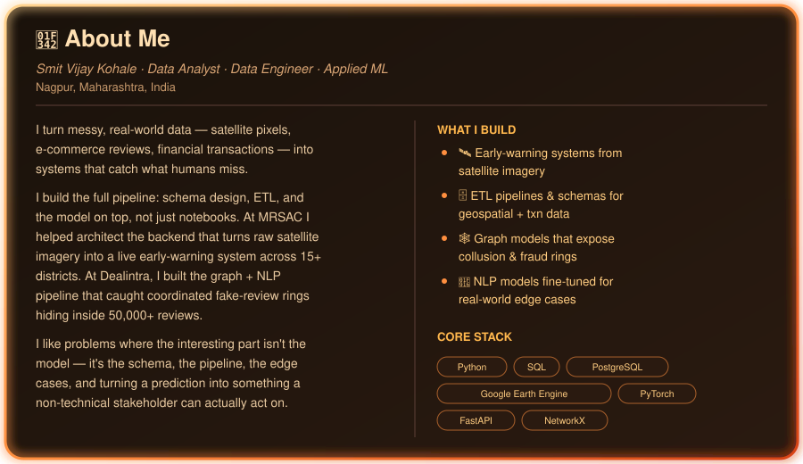
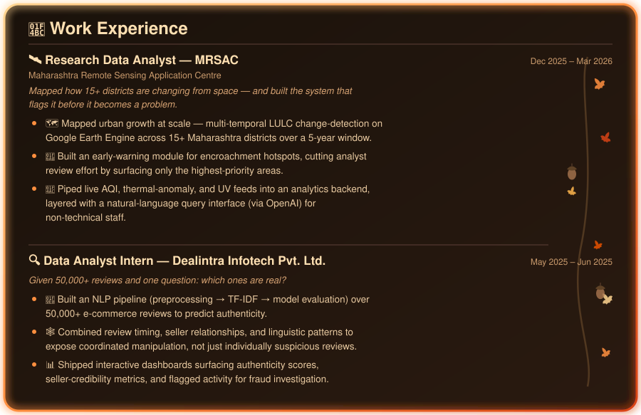
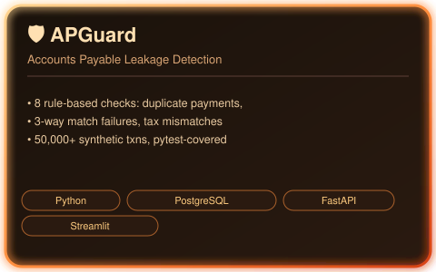
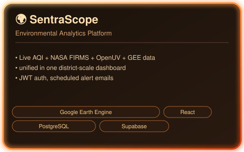
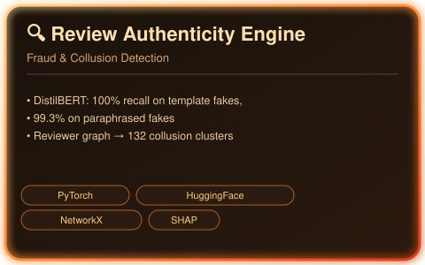
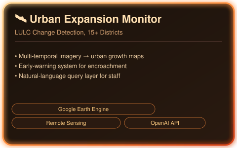

<!-- ============================================================ SMIT KOHALE — AUTUMN-THEMED GITHUB PROFILE README ============================================================ --> <!-- FALLING LEAVES (static emojis – always work) --> 
 🍂 🍂 🍂 
 <!-- TYPING ANIMATION HEADER --> 
  
 <!-- AUTUMN GRADIENT DIVIDER --> 
  
 <!-- PROFILE VIEWS & SOCIAL BADGES --> 
     
 
 <h2>🍂 About Me</h2> 
 
  
 
 <h2>🍁 Tech Stack — Painted in Autumn</h2> 
 <!-- Languages --> 
      <!-- Data & ML -->        <!-- Databases -->       <!-- Viz & App Dev -->       <!-- Geospatial & Graph -->      <!-- Tools -->     
 
 <h2>💼 Work Experience</h2> 
 
  
 
 <h2>🎃 Featured Projects — Harvest Season</h2> 
 
 ✨ click any card to open the repo 
 <table align="center"> <tr> <td width="50%" valign="top" align="center">  </td> <td width="50%" valign="top" align="center">  </td> </tr> <tr> <td width="50%" valign="top" align="center">  </td> <td width="50%" valign="top" align="center">  </td> </tr> </table> 
 <h2>📊 GitHub Metrics — Autumn Analytics</h2> 
 
 This section rebuilds itself daily via GitHub Actions and lives right here in the repo —  no third-party dependency to go down when everyone else's does. 
 
  
 
  
 
 <h2>🍂 Contribution Graph — Falling Leaves</h2> 
 
  
 
 <picture> <source media="(prefers-color-scheme: dark)" srcset="https://github.com/platane/snk/raw/output/github-contribution-grid-snake-dark.svg"> <source media="(prefers-color-scheme: light)" srcset="https://github.com/platane/snk/raw/output/github-contribution-grid-snake.svg">  </picture> 
 
 <h2>📜 Certifications</h2> 
 
 <ul style="list-style-type:none; padding-left:0;"> <li>✔️ <strong>Ask Questions to Make Data-Driven Decisions</strong> – Coursera (Oct 2025)</li> <li>✔️ <strong>Big Data Computing</strong> – NPTEL (IIT), 78%</li> </ul> 
 
 <h2>🦊 Connect With Me</h2> 
 
       
 
 🍂 🍂 🍂 
 <!-- FOOTER WAVE --> 
  
 
 🍂 If you made it this far, let's talk data — reach out anytime 🍂 

